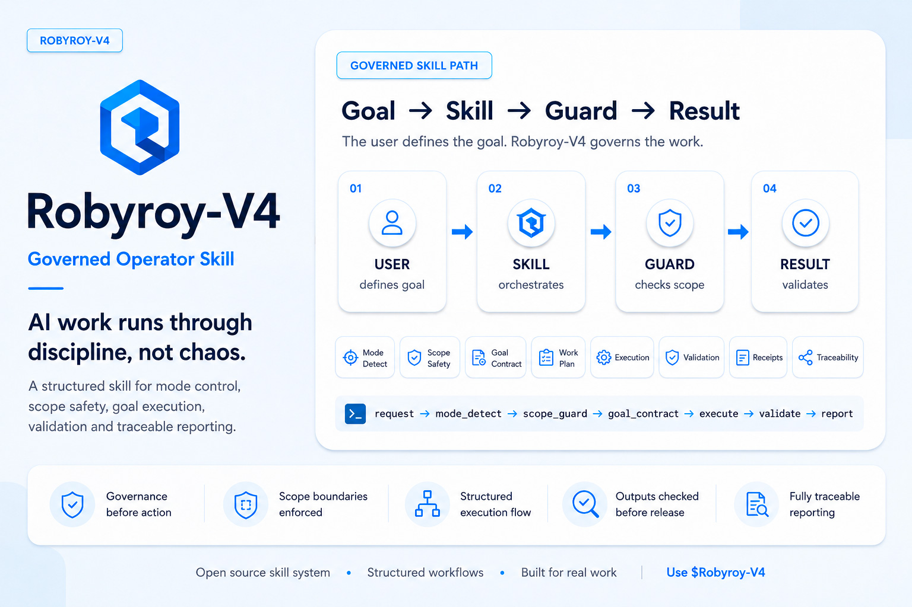

<p align="center">
  
</p>

# Robyroy-V4
## Governed Operator Skill for Structured Agent Work

Robyroy-V4 is an experimental local skill for Codex/Cody-style agents. It turns open-ended agent work into scoped, goal-driven, checked and reportable execution.

It is not AIOS, not a production security runtime and not global enforcement. It is a local operating discipline made of instructions, contract files, helper scripts, templates, checks, private event logs and proposal-only improvement loops.

## What Robyroy-V4 Is Today

Robyroy-V4 helps an agent work through:

- a clear mode and Goal Contract;
- explicit scope and forbidden actions;
- Karpathy-style coding discipline: think first, keep changes simple, modify only relevant files and tie every edit to a goal;
- controlled mini-prompt chains for bounded multi-step work;
- prompt-chain/self-handoff trace files when continuation planning matters;
- lifecycle receipts that declare logging, trace, handoff, prompt-chain, runner, report-check and improvement-candidate status;
- local event/usage logging and proposal-only improvement candidates;
- hook readiness material for project-local, manually reviewed hooks.

The skill is designed to reduce ambiguity. A V4 run should say what happened, what was checked, what was not applicable and what remains limited.

## Core Idea

```text
User goal -> V4 session -> Goal Contract -> Scope/claim discipline -> Patch/check/report -> Lifecycle receipt
```

For non-trivial tasks, V4 should open a lightweight local session, record relevant events when safe, apply compact pre-edit discipline, check the final report and close with lifecycle statuses. For tiny tasks, the lifecycle may be compact, but the final report should still declare what was applicable.

## Architecture

- `SKILL.md`: the main human/operator instructions loaded by the agent.
- `contract/*.json`: machine-readable contract, capabilities, failure codes, report schema and repair hints.
- `scripts/*.py`: deterministic local helpers for mode detection, scope/report checks, usage logs, lifecycle actions, controlled runners and doctor checks.
- `templates/*.md`: stable forms for AGENTS files, project context, trace files, handoff notes and lifecycle receipts.
- `evolution/*.jsonl`: local/private event, usage and improvement logs. These are runtime artifacts, not public evidence to publish.
- `hooks-readiness/`: proposal-only hook readiness pack. Hooks are not active by default.

## Current Capability Map

### Goal and Scope Discipline

V4 starts from a goal, workspace, allowed paths, forbidden paths, success criteria, validation plan and stop conditions. If scope is unclear, it should stop or ask a precise question.

### Karpathy Discipline Layer

For coding/refactor/patch/migration tasks, V4 should:

- think before editing;
- prefer the smallest sufficient change;
- avoid speculative abstraction and unrequested feature expansion;
- change only files directly connected to the objective;
- report why each file changed;
- avoid strong claims unless evidence supports them.

This is local behavior guidance, not magic enforcement.

### Trace / Logging Applicability Policy

V4 should declare whether it logged, traced, used a runner, created handoff notes or used a prompt-chain. Micro-tasks may use `NOT_APPLICABLE`; serious tasks should log or explain why logging/trace was not created.

### Auto Session Lifecycle

The local skill includes `scripts/v4_session_lifecycle.py`, a small dependency-free orchestrator with actions such as `start`, `event`, `check-report`, `finish` and `suggest`.

Final receipts should include:

```text
V4_SESSION_STATUS:
EVENT_LOGGING_STATUS:
V4_TRACE_STATUS:
HANDOFF_STATUS:
PROMPT_CHAIN_STATUS:
RUNNER_STATUS:
REPORT_CHECK_STATUS:
IMPROVEMENT_CANDIDATE_STATUS:
```

### Controlled Mini-Prompt Chain and Handoff

For multi-step work, V4 can structure bounded next prompts and handoff notes. The chain is scoped, limited and must not become an autonomous loop. It must not execute POWER actions automatically.

### Improvement Candidates

V4 can record repeated issues or improvement candidates. These are proposal-only. They require user approval before any skill change is applied.

### Hook Readiness

Hook readiness exists for future project-local automation. The recommended posture is warning/logging-only first, manual trust review and smoke tests. Global hooks are not active by default.

## Practical Usage

Short prompt style:

```text
$robyroy-v4
OBJECTIVE: Update this README section.
CONSTRAINTS: no commit, no push, docs only.
```

V4 should handle lifecycle/log/report discipline internally. The user should not need to remember every receipt status manually.

## Validation

Useful local checks:

```bash
python3 scripts/v4_doctor_check.py
python3 scripts/v4_contract_check.py
python3 scripts/v4_report_check.py path/to/final-report.md
python3 scripts/v4_session_lifecycle.py check-report --report path/to/final-report.md
python3 scripts/v4_prompt_runner.py --list
```

Treat these as local checks, not external guarantees.

## Example Lifecycle Receipt

```text
MODE:
GOAL:
SCOPE:
FILES_CREATED:
FILES_MODIFIED:
SCRIPTS_COMMANDS_USED:
TESTS_VALIDATIONS:
LIMITS:
STATUS:
NEXT_ACTION:
V4_SESSION_STATUS:
EVENT_LOGGING_STATUS:
V4_TRACE_STATUS:
HANDOFF_STATUS:
PROMPT_CHAIN_STATUS:
RUNNER_STATUS:
REPORT_CHECK_STATUS:
IMPROVEMENT_CANDIDATE_STATUS:
STOP_CONDITIONS:
```

## Limitations

- Local skill behavior depends on the agent following the skill.
- Runtime logs are local/private and should not be published as public proof.
- Hooks are readiness material unless a user separately reviews and activates project-local hooks.
- V4 is not a replacement for runtime governance systems such as AIOS.
- V4 is not a security product and should not be described as globally enforced.

## License

See [LICENSE](LICENSE).
